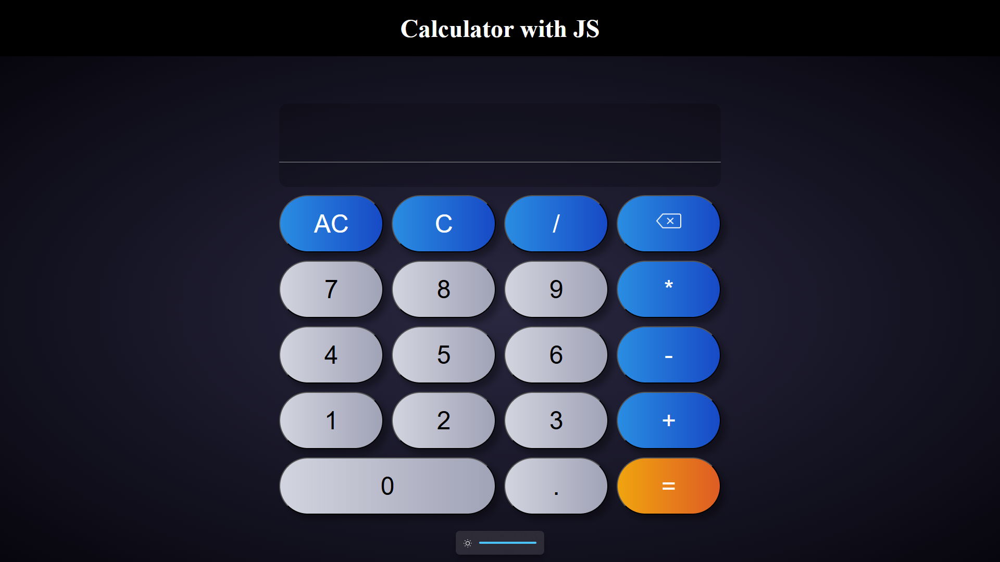

# Calculator App

A modern and responsive calculator application built using **HTML, CSS, and JavaScript**, focusing on clean UI, accurate logic, and smooth user interaction.

## Overview

This calculator provides a simple yet powerful interface for performing basic arithmetic operations. It supports both mouse and keyboard input, allowing users to interact naturally without breaking calculation flow.

## Screenshots

### Calculator UI

## Features

- Fully functional calculator with basic arithmetic operations
- Supports **mouse clicks and keyboard input**
- Allows alternating between keyboard and click input within the same expression without affecting the result
- **AC (All Clear)** clears the entire expression and answer
- **C (Clear)** clears only the current expression while preserving the answer
- Backspace functionality to remove the last entered character
- Accurate and reliable calculation handling

## User Interface

- Clean and user-friendly design
- Well-spaced buttons for better usability
- Smooth interaction feedback for an improved experience

## Responsive Design

- Fully responsive layout
- Works seamlessly across different screen sizes, including desktop, tablet, and mobile devices

## Technologies Used

- HTML
- CSS
- JavaScript

## Development Details

- Designed and developed independently
- All logic, UI, and responsiveness implemented from scratch
- No external libraries or code generators used

## Project Status

✅ Completed

## Author

**Yashkamal Saraiya**
